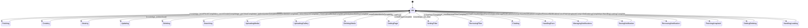

```mermaid
stateDiagram-v2
    [*] --> Idle
    Idle --> Fetching : knowledge_fetchModel
    Idle --> Creating : knowledge_createModel
    Idle --> Viewing : knowledge_getModel
    Idle --> Updating : knowledge_updateModel
    Idle --> Deleting : knowledge_deleteModel
    Idle --> Searching : knowledge_searchModel
    Idle --> UploadingMedia : knowledge_media_upload
    Idle --> UploadingGallery : knowledge_gallery_upload
    Idle --> DeletingMedia : knowledge_media_delete
    Idle --> SettingPage : knowledge_setPage
    Idle --> SettingFilter : knowledge_set_filter
    Idle --> RemovingFilter : knowledge_remove_filter
    Idle --> Chatting : knowledge_chat
    Idle --> HandlingForm : knowledge_form
    Idle --> ManagingNotifications : notifications
    Idle --> SavingNotification : saveNotification
    Idle --> RemovingNotification : removeNotification
    Idle --> FetchingUnsplash : getUnsplash
    Idle --> SettingDeleting : setDeleting
    Idle --> HandlingLoading : knowledge_loading

    Fetching --> Idle : onFetchComplete
    Creating --> Idle : onCreateComplete
    Viewing --> Idle : onViewComplete
    Updating --> Idle : onUpdateComplete
    Deleting --> Idle : onDeleteComplete
    Searching --> Idle : onSearchComplete
    UploadingMedia --> Idle : onUploadMediaComplete
    UploadingGallery --> Idle : onUploadGalleryComplete
    DeletingMedia --> Idle : onDeleteMediaComplete
    SettingPage --> Idle : onSetPageComplete
    SettingFilter --> Idle : onSetFilterComplete
    RemovingFilter --> Idle : onRemoveFilterComplete
    Chatting --> Idle : onChatComplete
    HandlingForm --> Idle : onFormComplete
    ManagingNotifications --> Idle : onManageNotificationsComplete
    SavingNotification --> Idle : onSaveNotificationComplete
    RemovingNotification --> Idle : onRemoveNotificationComplete
    FetchingUnsplash --> Idle : onFetchUnsplashComplete
    SettingDeleting --> Idle : onSetDeletingComplete
    HandlingLoading --> Idle : onHandlingLoadingComplete
```