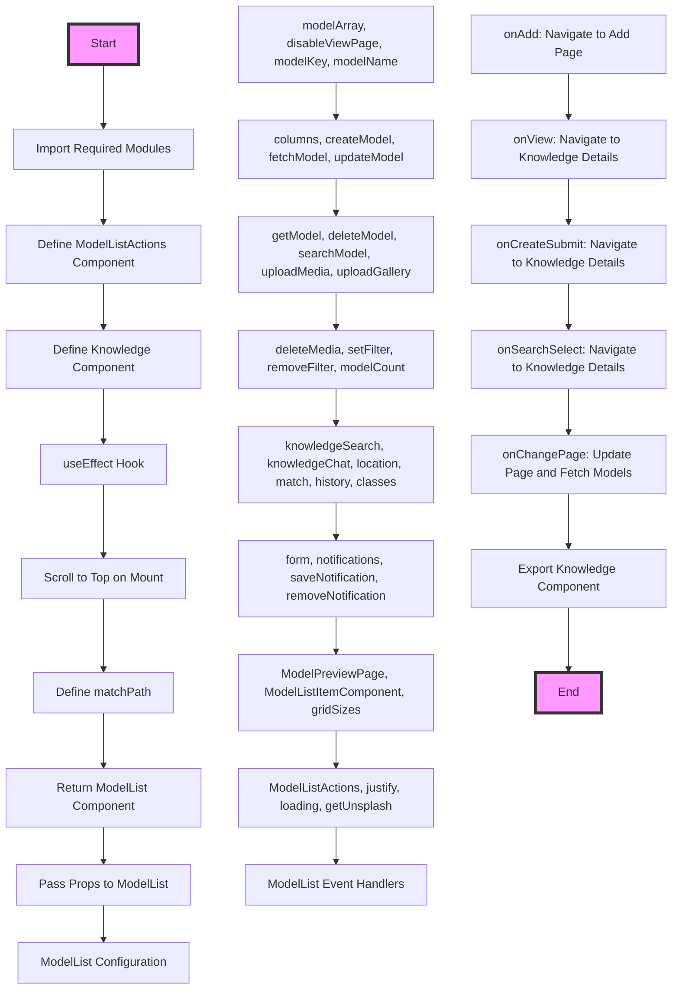

```mermaid
flowchart TD
    A[Start] --> B[Import Required Modules]
    B --> C[Define ModelListActions Component]
    C --> D[Define Knowledge Component]

    D --> E[useEffect Hook]
    E --> F[Scroll to Top on Mount]
    F --> G[Define matchPath]

    G --> H[Return ModelList Component]
    H --> I[Pass Props to ModelList]

    I --> J[ModelList Configuration]
    J1[modelArray, disableViewPage, modelKey, modelName] --> J2[columns, createModel, fetchModel, updateModel]
    J2 --> J3[getModel, deleteModel, searchModel, uploadMedia, uploadGallery]
    J3 --> J4[deleteMedia, setFilter, removeFilter, modelCount]
    J4 --> J5[knowledgeSearch, knowledgeChat, location, match, history, classes]
    J5 --> J6[form, notifications, saveNotification, removeNotification]
    J6 --> J7[ModelPreviewPage, ModelListItemComponent, gridSizes]
    J7 --> J8[ModelListActions, justify, loading, getUnsplash]

    J8 --> K[ModelList Event Handlers]
    K1[onAdd: Navigate to Add Page] --> K2[onView: Navigate to Knowledge Details]
    K2 --> K3[onCreateSubmit: Navigate to Knowledge Details]
    K3 --> K4[onSearchSelect: Navigate to Knowledge Details]
    K4 --> K5[onChangePage: Update Page and Fetch Models]

    K5 --> L[Export Knowledge Component]
    L --> M[End]

    style A fill:#f9f,stroke:#333,stroke-width:4px
    style M fill:#f9f,stroke:#333,stroke-width:4px
```