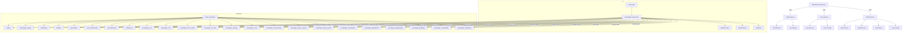

```mermaid
graph TB
    A[Orbital Unit Framework] -->|uses| B[CRUD Service]
    A -->|uses| C[Forms Service]
    A -->|uses| D[Media Service]

    B --> E[Create Route]
    B --> F[Read Route]
    B --> G[Update Route]
    B --> H[Delete Route]

    C --> I[Form Storage]
    C --> J[Form Serving]

    D --> K[File Storage]
    D --> L[File Retrieval]

    subgraph UI
        M[React App]
        M --> N[Knowledge Component]
        N --> O[ModelList]
        N --> P[ModelListItem]
        N --> Q[ModelPreview]
    end

    subgraph Backend
        R[Node.js Backend]
        R --> S[knowledge_fetchModel]
        R --> T[knowledge_createModel]
        R --> U[knowledge_getModel]
        R --> V[knowledge_updateModel]
        R --> W[knowledge_deleteModel]
        R --> X[knowledge_searchModel]
        R --> Y[knowledge_media_upload]
        R --> Z[knowledge_gallery_upload]
        R --> AA[knowledge_media_delete]
        R --> AB[knowledge_count]
        R --> AC[knowledge_setPage]
        R --> AD[knowledge_set_filter]
        R --> AE[knowledge_remove_filter]
        R --> AF[knowledge_chat]
        R --> AG[knowledge_form]
        R --> AH[notifications]
        R --> AI[saveNotification]
        R --> AJ[removeNotification]
        R --> AK[getUnsplash]
        R --> AL[deleting]
        R --> AM[setDeleting]
        R --> AN[knowledge_loading]
        R --> AO[loading]
    end

    N -->|fetches data| S
    N -->|creates data| T
    N -->|gets data| U
    N -->|updates data| V
    N -->|deletes data| W
    N -->|searches data| X
    N -->|uploads media| Y
    N -->|uploads gallery| Z
    N -->|deletes media| AA
    N -->|gets count| AB
    N -->|sets page| AC
    N -->|sets filter| AD
    N -->|removes filter| AE
    N -->|chat functionality| AF
    N -->|form handling| AG
    N -->|manages notifications| AH
    N -->|saves notification| AI
    N -->|removes notification| AJ
    N -->|uses Unsplash API| AK
    N -->|handles deleting state| AL
    N -->|sets deleting state| AM
    N -->|handles loading state| AN
    N -->|sets loading state| AO
```