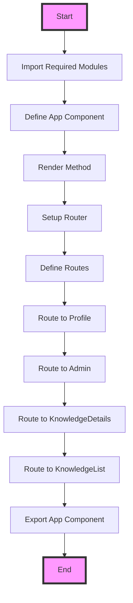

```mermaid
flowchart TD
    A[Start] --> B[Import Required Modules]
    B --> C[Define App Component]
    C --> D[Render Method]
    D --> E[Setup Router]
    E --> F[Define Routes]
    F --> G[Route to Profile]
    G --> H[Route to Admin]
    H --> I[Route to KnowledgeDetails]
    I --> J[Route to KnowledgeList]
    J --> K[Export App Component]
    K --> L[End]

    style A fill:#f9f,stroke:#333,stroke-width:4px
    style L fill:#f9f,stroke:#333,stroke-width:4px
```