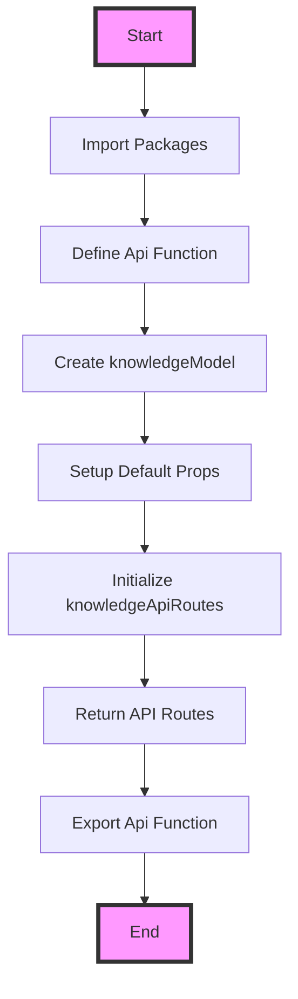

```mermaid
flowchart TD
    A[Start] --> B[Import Packages]
    B --> C[Define Api Function]
    C --> D[Create knowledgeModel]
    D --> E[Setup Default Props]
    E --> F[Initialize knowledgeApiRoutes]
    F --> G[Return API Routes]
    G --> H[Export Api Function]
    H --> I[End]

    style A fill:#f9f,stroke:#333,stroke-width:4px
    style I fill:#f9f,stroke:#333,stroke-width:4px
```