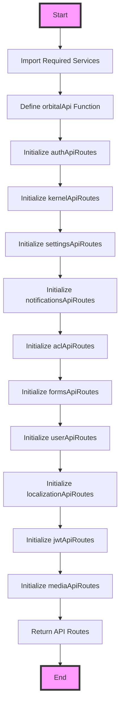

```mermaid
flowchart TD
    A[Start] --> B[Import Required Services]
    B --> C[Define orbitalApi Function]

    C --> D[Initialize authApiRoutes]
    D --> E[Initialize kernelApiRoutes]
    E --> F[Initialize settingsApiRoutes]
    F --> G[Initialize notificationsApiRoutes]
    G --> H[Initialize aclApiRoutes]
    H --> I[Initialize formsApiRoutes]
    I --> J[Initialize userApiRoutes]
    J --> K[Initialize localizationApiRoutes]
    K --> L[Initialize jwtApiRoutes]
    L --> M[Initialize mediaApiRoutes]

    M --> N[Return API Routes]
    N --> O[End]

    style A fill:#f9f,stroke:#333,stroke-width:4px
    style O fill:#f9f,stroke:#333,stroke-width:4px
```