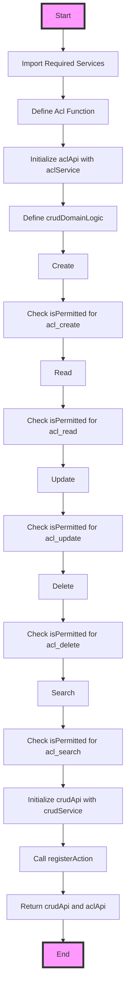

```mermaid
flowchart TD
    A[Start] --> B[Import Required Services]
    B --> C[Define Acl Function]
    C --> D[Initialize aclApi with aclService]
    D --> E[Define crudDomainLogic]

    E --> F[Create]
    F --> F1[Check isPermitted for acl_create]
    F1 --> G[Read]
    G --> G1[Check isPermitted for acl_read]
    G1 --> H[Update]
    H --> H1[Check isPermitted for acl_update]
    H1 --> I[Delete]
    I --> I1[Check isPermitted for acl_delete]
    I1 --> J[Search]
    J --> J1[Check isPermitted for acl_search]
    
    J1 --> K[Initialize crudApi with crudService]
    K --> L[Call registerAction]
    L --> M[Return crudApi and aclApi]
    M --> N[End]

    style A fill:#f9f,stroke:#333,stroke-width:4px
    style N fill:#f9f,stroke:#333,stroke-width:4px
```