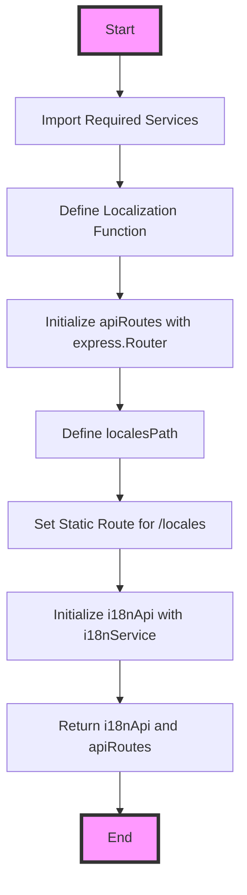

```mermaid
flowchart TD
    A[Start] --> B[Import Required Services]
    B --> C[Define Localization Function]
    C --> D[Initialize apiRoutes with express.Router]

    D --> E[Define localesPath]
    E --> F[Set Static Route for /locales]
    F --> G[Initialize i18nApi with i18nService]
    G --> H[Return i18nApi and apiRoutes]
    H --> I[End]

    style A fill:#f9f,stroke:#333,stroke-width:4px
    style I fill:#f9f,stroke:#333,stroke-width:4px
```