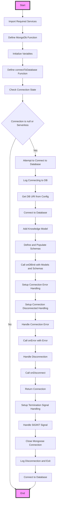

```mermaid
flowchart TD
    A[Start] --> B[Import Required Services]
    B --> C[Define MongoDb Function]
    C --> D[Initialize Variables]
    D --> E[Define connectToDatabase Function]
    E --> F[Check Connection State]
    F --> F1{Connection is null or Serverless}
    F1 --> |Yes| G[Attempt to Connect to Database]
    F1 --> |No| Z[Return Existing Connection]

    G --> H[Log Connecting to DB]
    H --> I[Get DB URI from Config]
    I --> J[Connect to Database]
    J --> K[Add Knowledge Model]

    K --> L[Define and Populate Schemas]
    L --> M[Call onDBInit with Models and Schemas]

    M --> N[Setup Connection Error Handling]
    N --> O[Setup Connection Disconnected Handling]
    O --> P[Handle Connection Error]
    P --> Q[Call onError with Error]
    Q --> R[Handle Disconnection]
    R --> S[Call onDisconnect]

    S --> T[Return Connection]
    
    T --> U[Setup Termination Signal Handling]
    U --> V[Handle SIGINT Signal]
    V --> W[Close Mongoose Connection]
    W --> X[Log Disconnection and Exit]
    
    X --> Y[Connect to Database]
    Y --> Z[End]

    style A fill:#f9f,stroke:#333,stroke-width:4px
    style Z fill:#f9f,stroke:#333,stroke-width:4px
```