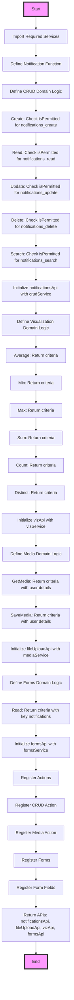

```mermaid
flowchart TD
    A[Start] --> B[Import Required Services]
    B --> C[Define Notification Function]
    C --> D[Define CRUD Domain Logic]
    D --> D1[Create: Check isPermitted for notifications_create]
    D1 --> D2[Read: Check isPermitted for notifications_read]
    D2 --> D3[Update: Check isPermitted for notifications_update]
    D3 --> D4[Delete: Check isPermitted for notifications_delete]
    D4 --> D5[Search: Check isPermitted for notifications_search]
    D5 --> E[Initialize notificationsApi with crudService]
    E --> F[Define Visualization Domain Logic]
    F --> F1[Average: Return criteria]
    F1 --> F2[Min: Return criteria]
    F2 --> F3[Max: Return criteria]
    F3 --> F4[Sum: Return criteria]
    F4 --> F5[Count: Return criteria]
    F5 --> F6[Distinct: Return criteria]
    F6 --> G[Initialize vizApi with vizService]
    G --> H[Define Media Domain Logic]
    H --> H1[GetMedia: Return criteria with user details]
    H1 --> H2[SaveMedia: Return criteria with user details]
    H2 --> I[Initialize fileUploadApi with mediaService]
    I --> J[Define Forms Domain Logic]
    J --> J1[Read: Return criteria with key notifications]
    J1 --> K[Initialize formsApi with formsService]
    K --> L[Register Actions]
    L --> L1[Register CRUD Action]
    L1 --> L2[Register Media Action]
    L2 --> M[Register Forms]
    M --> M1[Register Form Fields]
    M1 --> N[Return APIs: notificationsApi, fileUploadApi, vizApi, formsApi]
    N --> O[End]

    style A fill:#f9f,stroke:#333,stroke-width:4px
    style O fill:#f9f,stroke:#333,stroke-width:4px
```