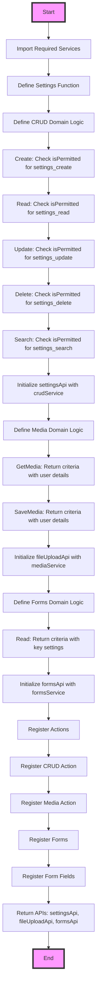

```mermaid
flowchart TD
    A[Start] --> B[Import Required Services]
    B --> C[Define Settings Function]

    C --> D[Define CRUD Domain Logic]
    D --> D1[Create: Check isPermitted for settings_create]
    D1 --> D2[Read: Check isPermitted for settings_read]
    D2 --> D3[Update: Check isPermitted for settings_update]
    D3 --> D4[Delete: Check isPermitted for settings_delete]
    D4 --> D5[Search: Check isPermitted for settings_search]

    D5 --> E[Initialize settingsApi with crudService]

    E --> F[Define Media Domain Logic]
    F --> F1[GetMedia: Return criteria with user details]
    F1 --> F2[SaveMedia: Return criteria with user details]

    F2 --> G[Initialize fileUploadApi with mediaService]

    G --> H[Define Forms Domain Logic]
    H --> H1[Read: Return criteria with key settings]

    H1 --> I[Initialize formsApi with formsService]

    I --> J[Register Actions]
    J --> J1[Register CRUD Action]
    J1 --> J2[Register Media Action]

    J2 --> K[Register Forms]
    K --> K1[Register Form Fields]

    K1 --> L[Return APIs: settingsApi, fileUploadApi, formsApi]
    L --> M[End]

    style A fill:#f9f,stroke:#333,stroke-width:4px
    style M fill:#f9f,stroke:#333,stroke-width:4px
```