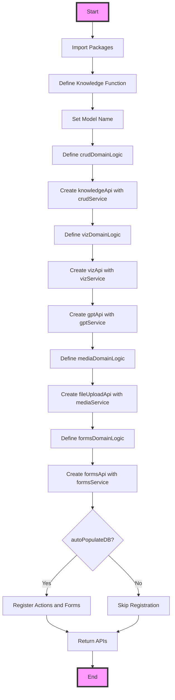

make me a conceptual architecture diagram of my new "Programming Framework For the AI age".

I will give you the general idea and then present you with a bunch of flow charts describing exactly how this framework is built.

the idea is that this framework is a functional composition of different modules that build on top of each other. The Orbital name here suggests that the "unit" or building block of this system is called "Orbital unit" and this orbital unit can be invoked with "Model name" parameter to produce a full nodejs backend and react frontend code. It's very powerfull due to this dual nature that it imposes.

notice how domainLogic is used here. This is where we define any custom logic inside of let's say forms, media or crud.

can you make me a more general diagram than that. Think of an integration document.

this is how the "CRUD service is"

One example of such service is the CRUD service (responsible for creating create read update routes) as well as Forms (responsible for storing and serving form data over http and other interfaces). Media, where we can store files and retrieve them.

your task is create a full conceptual chart of the Orbital Unit.

here is more flow charts of the other services:
here is the forms service chart:

here is both media and forms service:

Here is a flowchart of how this orbital unit is composed from the outside (Model Name= knowledge):

