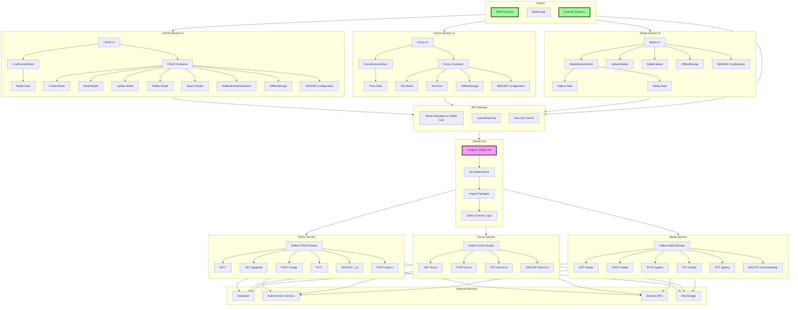

```mermaid
flowchart TB
    subgraph OrbitalUnit [Orbital Unit]
        direction TB
        A[Initialize Orbital Unit]
        B[Set Model Name]
        C[Import Packages]
        D[Define Domain Logic]
        
        A --> B
        B --> C
        C --> D
    end

    subgraph CRUDService [CRUD Service]
        direction TB
        E[Define CRUD Routes]
        E1[GET /]
        E2[GET /paginate]
        E3[POST /create]
        E4[PUT /]
        E5[DELETE /:_id]
        E6[POST /search]
        
        E --> E1
        E --> E2
        E --> E3
        E --> E4
        E --> E5
        E --> E6
    end

    subgraph CRUDServiceFrontend [CRUD Service UI]
        direction TB
        CRUD_UI[CRUD UI]
        CRUD_UI --> F[CrudDomainStore]
        F --> G[Model Data]
        CRUD_UI --> H[CRUD Container]
        H --> I[Create Model]
        H --> J[Read Model]
        H --> K[Update Model]
        H --> L[Delete Model]
        H --> M[Search Model]
        H --> N[NotificationDomainStore]
        H --> O[OfflineStorage]
        H --> P[SERVER Configuration]
    end

    subgraph FormsService [Forms Service]
        direction TB
        F1[Define Forms Routes]
        F2[GET /forms]
        F3[POST /forms]
        F4[PUT /forms/:id]
        F5[DELETE /forms/:id]
        
        F1 --> F2
        F1 --> F3
        F1 --> F4
        F1 --> F5
    end

    subgraph FormsServiceFrontend [Forms Service UI]
        direction TB
        FORMS_UI[Forms UI]
        FORMS_UI --> Q[FormsDomainStore]
        Q --> R[Form Data]
        FORMS_UI --> S[Forms Container]
        S --> T[Get Model]
        S --> U[Set Error]
        S --> V[OfflineStorage]
        S --> W[SERVER Configuration]
    end

    subgraph MediaService [Media Service]
        direction TB
        G1[Define Media Routes]
        G2[GET /media]
        G3[POST /media]
        G4[POST /gallery]
        G5[PUT /media]
        G6[PUT /gallery]
        G7[DELETE /remove/media]
        
        G1 --> G2
        G1 --> G3
        G1 --> G4
        G1 --> G5
        G1 --> G6
        G1 --> G7
    end

    subgraph MediaServiceFrontend [Media Service UI]
        direction TB
        MEDIA_UI[Media UI]
        MEDIA_UI --> X[MediaDomainStore]
        X --> Y[Gallery Data]
        X --> Z[Media Data]
        MEDIA_UI --> AA[Upload Media]
        MEDIA_UI --> AB[Delete Media]
        MEDIA_UI --> AC[OfflineStorage]
        MEDIA_UI --> AD[SERVER Configuration]
    end

    subgraph ExternalServices [External Services]
        direction TB
        H1[Database]
        H2[Authentication Service]
        H3[External APIs]
        H4[File Storage]
    end

    subgraph APIGateway [API Gateway]
        direction TB
        I1[Route Requests to Orbital Unit]
        I2[Load Balancing]
        I3[Security Checks]
    end

    subgraph Clients [Clients]
        direction TB
        J1[Web Frontend]
        J2[Mobile App]
        J3[External Systems]
    end

    Clients --> CRUDServiceFrontend
    Clients --> FormsServiceFrontend
    Clients --> MediaServiceFrontend
    CRUDServiceFrontend --> APIGateway
    FormsServiceFrontend --> APIGateway
    MediaServiceFrontend --> APIGateway

    OrbitalUnit --> CRUDService
    OrbitalUnit --> FormsService
    OrbitalUnit --> MediaService
    
    CRUDService --> H1
    CRUDService --> H2
    CRUDService --> H3
    CRUDService --> H4

    FormsService --> H1
    FormsService --> H2
    FormsService --> H3
    FormsService --> H4

    MediaService --> H1
    MediaService --> H2
    MediaService --> H3
    MediaService --> H4

    Clients --> APIGateway
    APIGateway --> OrbitalUnit

    style A fill:#f9f,stroke:#333,stroke-width:4px
    style J1 fill:#9f9,stroke:#333,stroke-width:4px
    style J3 fill:#9f9,stroke:#333,stroke-width:4px
```