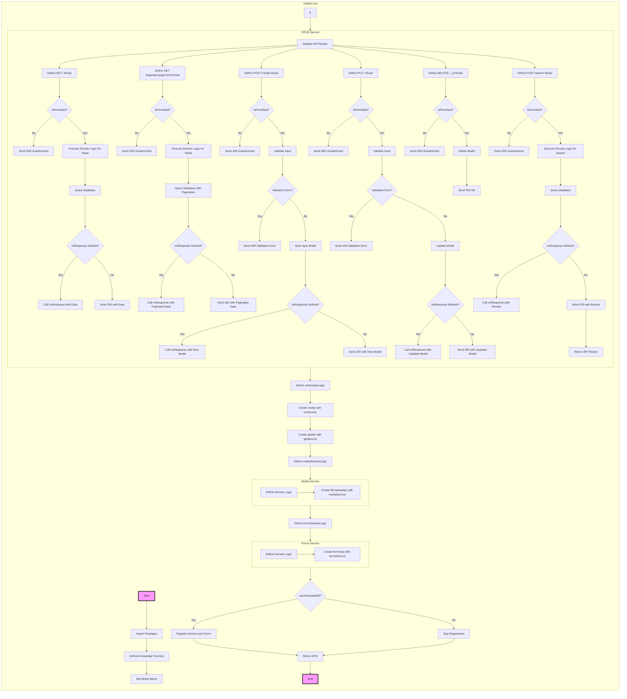

```mermaid
flowchart TB
    subgraph OrbitalUnit [Orbital Unit]
        direction TB
        A[Start] --> B[Import Packages]
        B --> C[Define Knowledge Function]
        C --> D[Set Model Name]

        subgraph CRUDService [CRUD Service]
            direction TB
            D1[Initialize API Routes] --> D2[Define GET / Route]
            D2 --> D3{isPermitted?}
            D3 -->|No| D4[Send 409 Unauthorized]
            D3 -->|Yes| D5[Execute Domain Logic for Read]
            D5 --> D6[Query Database]
            D6 --> D7{onResponse Defined?}
            D7 -->|Yes| D8[Call onResponse with Data]
            D7 -->|No| D9[Send 200 with Data]

            D1 --> D10[Define GET /paginate/:page/:limit Route]
            D10 --> D11{isPermitted?}
            D11 -->|No| D12[Send 409 Unauthorized]
            D11 -->|Yes| D13[Execute Domain Logic for Read]
            D13 --> D14[Query Database with Pagination]
            D14 --> D15{onResponse Defined?}
            D15 -->|Yes| D16[Call onResponse with Paginated Data]
            D15 -->|No| D17[Send 200 with Paginated Data]

            D1 --> D18[Define POST /create Route]
            D18 --> D19{isPermitted?}
            D19 -->|No| D20[Send 409 Unauthorized]
            D19 -->|Yes| D21[Validate Input]
            D21 --> D22{Validation Error?}
            D22 -->|Yes| D23[Send 409 Validation Error]
            D22 -->|No| D24[Save New Model]
            D24 --> D25{onResponse Defined?}
            D25 -->|Yes| D26[Call onResponse with New Model]
            D25 -->|No| D27[Send 200 with New Model]

            D1 --> D28[Define PUT / Route]
            D28 --> D29{isPermitted?}
            D29 -->|No| D30[Send 409 Unauthorized]
            D29 -->|Yes| D31[Validate Input]
            D31 --> D32{Validation Error?}
            D32 -->|Yes| D33[Send 409 Validation Error]
            D32 -->|No| D34[Update Model]
            D34 --> D35{onResponse Defined?}
            D35 -->|Yes| D36[Call onResponse with Updated Model]
            D35 -->|No| D37[Send 200 with Updated Model]

            D1 --> D38[Define DELETE /:_id Route]
            D38 --> D39{isPermitted?}
            D39 -->|No| D40[Send 409 Unauthorized]
            D39 -->|Yes| D41[Delete Model]
            D41 --> D42[Send 200 OK]

            D1 --> D43[Define POST /search Route]
            D43 --> D44{isPermitted?}
            D44 -->|No| D45[Send 409 Unauthorized]
            D44 -->|Yes| D46[Execute Domain Logic for Search]
            D46 --> D47[Query Database]
            D47 --> D48{onResponse Defined?}
            D48 -->|Yes| D49[Call onResponse with Results]
            D48 -->|No| D50[Send 200 with Results]

            D50 --> D51[Return API Routes]
        end

        E --> CRUDService
        CRUDService --> F[Define vizDomainLogic]
        F --> G[Create vizApi with vizService]
        G --> H[Create gptApi with gptService]
        H --> I[Define mediaDomainLogic]

        subgraph MediaService [Media Service]
            I1[Define Domain Logic] --> I2[Create fileUploadApi with mediaService]
        end

        I --> MediaService
        MediaService --> J[Define formsDomainLogic]

        subgraph FormsService [Forms Service]
            J1[Define Domain Logic] --> J2[Create formsApi with formsService]
        end

        J --> FormsService
        FormsService --> K{autoPopulateDB?}
        K -->|Yes| L[Register Actions and Forms]
        K -->|No| M[Skip Registration]
        L --> N[Return APIs]
        M --> N
        N --> O[End]
    end

    style A fill:#f9f,stroke:#333,stroke-width:4px
    style O fill:#f9f,stroke:#333,stroke-width:4px
```