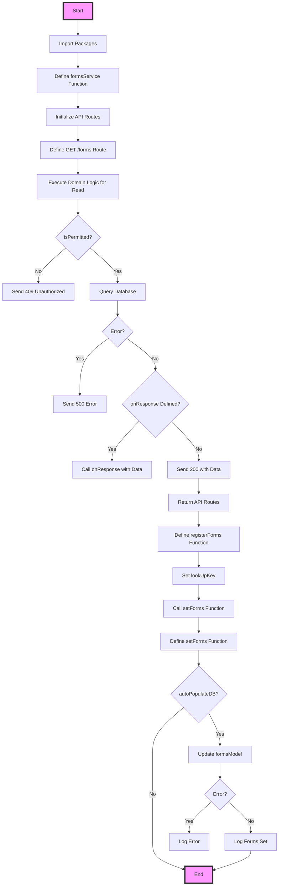

```mermaid
flowchart TD
    A[Start] --> B[Import Packages]
    B --> C[Define formsService Function]
    C --> D[Initialize API Routes]
    D --> E[Define GET /forms Route]
    E --> F[Execute Domain Logic for Read]
    F --> G{isPermitted?}
    G -->|No| H[Send 409 Unauthorized]
    G -->|Yes| I[Query Database]
    I --> J{Error?}
    J -->|Yes| K[Send 500 Error]
    J -->|No| L{onResponse Defined?}
    L -->|Yes| M[Call onResponse with Data]
    L -->|No| N[Send 200 with Data]
    N --> O[Return API Routes]
    
    O --> P[Define registerForms Function]
    P --> Q[Set lookUpKey]
    Q --> R[Call setForms Function]
    
    R --> S[Define setForms Function]
    S --> T{autoPopulateDB?}
    T -->|No| U[End]
    T -->|Yes| V[Update formsModel]
    V --> W{Error?}
    W -->|Yes| X[Log Error]
    W -->|No| Y[Log Forms Set]
    Y --> U

    style A fill:#f9f,stroke:#333,stroke-width:4px
    style U fill:#f9f,stroke:#333,stroke-width:4px
```