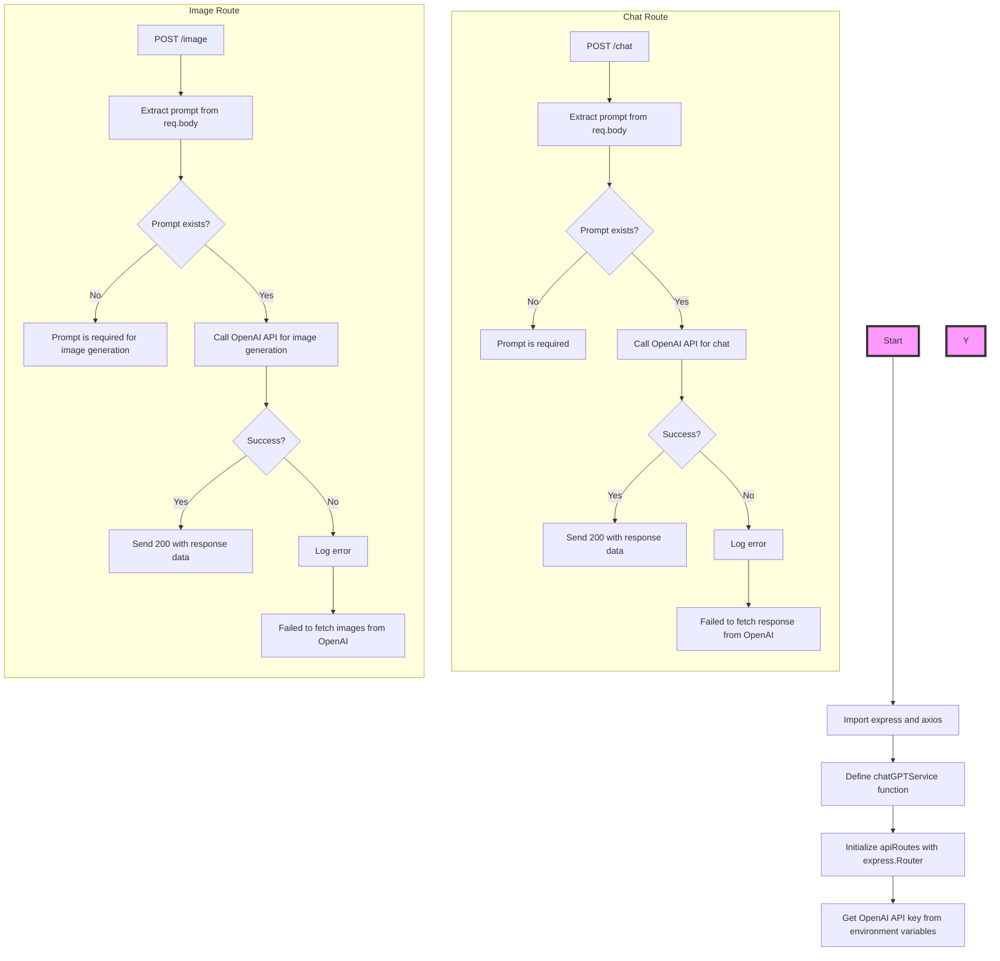

```mermaid
flowchart TD
    A[Start] --> B[Import express and axios]
    B --> C[Define chatGPTService function]
    C --> D[Initialize apiRoutes with express.Router]
    D --> E[Get OpenAI API key from environment variables]

    subgraph Chat Route
        direction TB
        F[POST /chat]
        F --> G[Extract prompt from req.body]
        G --> H{Prompt exists?}
        H -->|No| I[Prompt is required]
        H -->|Yes| J[Call OpenAI API for chat]
        J --> K{Success?}
        K -->|Yes| L[Send 200 with response data]
        K -->|No| M[Log error]
        M --> N[Failed to fetch response from OpenAI]
    end

    subgraph Image Route
        direction TB
        O[POST /image]
        O --> P[Extract prompt from req.body]
        P --> Q{Prompt exists?}
        Q -->|No| R[Prompt is required for image generation]
        Q -->|Yes| S[Call OpenAI API for image generation]
        S --> T{Success?}
        T -->|Yes| U[Send 200 with response data]
        T -->|No| V[Log error]
        V --> W[Failed to fetch images from OpenAI]
    end
    style A fill:#f9f,stroke:#333,stroke-width:4px
    style Y fill:#f9f,stroke:#333,stroke-width:4px
```