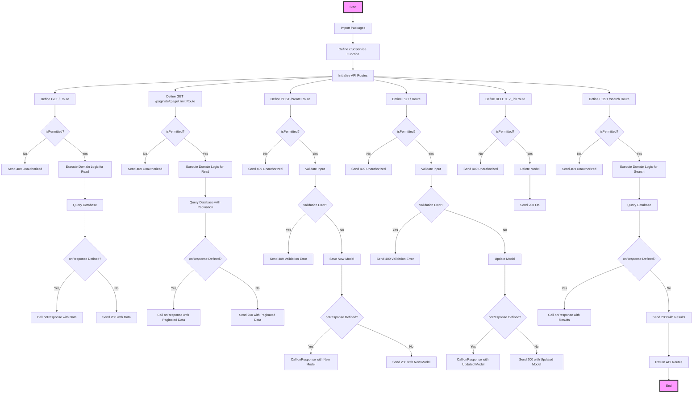

```mermaid
flowchart TD
    A[Start] --> B[Import Packages]
    B --> C[Define crudService Function]
    C --> D[Initialize API Routes]
    D --> E[Define GET / Route]
    E --> F{isPermitted?}
    F -->|No| G[Send 409 Unauthorized]
    F -->|Yes| H[Execute Domain Logic for Read]
    H --> I[Query Database]
    I --> J{onResponse Defined?}
    J -->|Yes| K[Call onResponse with Data]
    J -->|No| L[Send 200 with Data]
    
    D --> M[Define GET /paginate/:page/:limit Route]
    M --> N{isPermitted?}
    N -->|No| O[Send 409 Unauthorized]
    N -->|Yes| P[Execute Domain Logic for Read]
    P --> Q[Query Database with Pagination]
    Q --> R{onResponse Defined?}
    R -->|Yes| S[Call onResponse with Paginated Data]
    R -->|No| T[Send 200 with Paginated Data]
    
    D --> U[Define POST /create Route]
    U --> V{isPermitted?}
    V -->|No| W[Send 409 Unauthorized]
    V -->|Yes| X[Validate Input]
    X --> Y{Validation Error?}
    Y -->|Yes| Z[Send 409 Validation Error]
    Y -->|No| AA[Save New Model]
    AA --> AB{onResponse Defined?}
    AB -->|Yes| AC[Call onResponse with New Model]
    AB -->|No| AD[Send 200 with New Model]
    
    D --> AE[Define PUT / Route]
    AE --> AF{isPermitted?}
    AF -->|No| AG[Send 409 Unauthorized]
    AF -->|Yes| AH[Validate Input]
    AH --> AI{Validation Error?}
    AI -->|Yes| AJ[Send 409 Validation Error]
    AI -->|No| AK[Update Model]
    AK --> AL{onResponse Defined?}
    AL -->|Yes| AM[Call onResponse with Updated Model]
    AL -->|No| AN[Send 200 with Updated Model]
    
    D --> AO[Define DELETE /:_id Route]
    AO --> AP{isPermitted?}
    AP -->|No| AQ[Send 409 Unauthorized]
    AP -->|Yes| AR[Delete Model]
    AR --> AS[Send 200 OK]

    D --> AT[Define POST /search Route]
    AT --> AU{isPermitted?}
    AU -->|No| AV[Send 409 Unauthorized]
    AU -->|Yes| AW[Execute Domain Logic for Search]
    AW --> AX[Query Database]
    AX --> AY{onResponse Defined?}
    AY -->|Yes| AZ[Call onResponse with Results]
    AY -->|No| BA[Send 200 with Results]

    BA --> BB[Return API Routes]
    BB --> BC[End]

    style A fill:#f9f,stroke:#333,stroke-width:4px
    style BC fill:#f9f,stroke:#333,stroke-width:4px
```