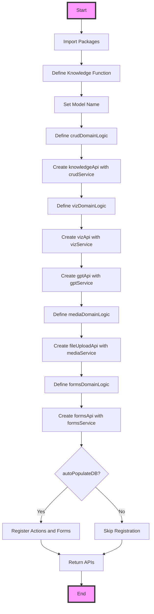

```mermaid
flowchart TD
    A[Start] --> B[Import Packages]
    B --> C[Define Knowledge Function]
    C --> D[Set Model Name]
    D --> E[Define crudDomainLogic]
    E --> F[Create knowledgeApi with crudService]
    F --> G[Define vizDomainLogic]
    G --> H[Create vizApi with vizService]
    H --> I[Create gptApi with gptService]
    I --> J[Define mediaDomainLogic]
    J --> K[Create fileUploadApi with mediaService]
    K --> L[Define formsDomainLogic]
    L --> M[Create formsApi with formsService]
    M --> N{autoPopulateDB?}
    N -->|Yes| O[Register Actions and Forms]
    N -->|No| P[Skip Registration]
    O --> Q[Return APIs]
    P --> Q
    Q --> R[End]

    style A fill:#f9f,stroke:#333,stroke-width:4px
    style R fill:#f9f,stroke:#333,stroke-width:4px
```