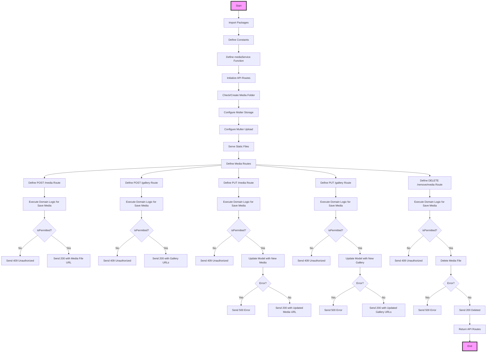

```mermaid
flowchart TD
    A[Start] --> B[Import Packages]
    B --> C[Define Constants]
    C --> D[Define mediaService Function]
    D --> E[Initialize API Routes]
    E --> F[Check/Create Media Folder]
    F --> G[Configure Multer Storage]
    G --> H[Configure Multer Upload]

    H --> I[Serve Static Files]
    I --> J[Define Media Routes]
    
    J --> K[Define POST /media Route]
    K --> L[Execute Domain Logic for Save Media]
    L --> M{isPermitted?}
    M -->|No| N[Send 409 Unauthorized]
    M -->|Yes| O[Send 200 with Media File URL]

    J --> P[Define POST /gallery Route]
    P --> Q[Execute Domain Logic for Save Media]
    Q --> R{isPermitted?}
    R -->|No| S[Send 409 Unauthorized]
    R -->|Yes| T[Send 200 with Gallery URLs]

    J --> U[Define PUT /media Route]
    U --> V[Execute Domain Logic for Save Media]
    V --> W{isPermitted?}
    W -->|No| X[Send 409 Unauthorized]
    W -->|Yes| Y[Update Model with New Media]
    Y --> Z{Error?}
    Z -->|Yes| AA[Send 500 Error]
    Z -->|No| AB[Send 200 with Updated Media URL]

    J --> AC[Define PUT /gallery Route]
    AC --> AD[Execute Domain Logic for Save Media]
    AD --> AE{isPermitted?}
    AE -->|No| AF[Send 409 Unauthorized]
    AE -->|Yes| AG[Update Model with New Gallery]
    AG --> AH{Error?}
    AH -->|Yes| AI[Send 500 Error]
    AH -->|No| AJ[Send 200 with Updated Gallery URLs]

    J --> AK[Define DELETE /remove/media Route]
    AK --> AL[Execute Domain Logic for Save Media]
    AL --> AM{isPermitted?}
    AM -->|No| AN[Send 409 Unauthorized]
    AM -->|Yes| AO[Delete Media File]
    AO --> AP{Error?}
    AP -->|Yes| AQ[Send 500 Error]
    AP -->|No| AR[Send 200 Deleted]

    AR --> AS[Return API Routes]
    AS --> AT[End]

    style A fill:#f9f,stroke:#333,stroke-width:4px
    style AT fill:#f9f,stroke:#333,stroke-width:4px
```