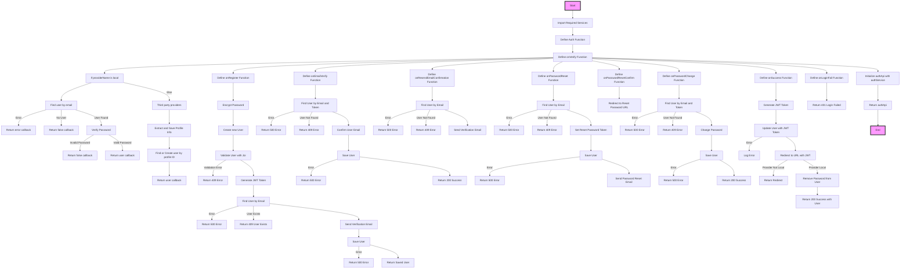

```mermaid
flowchart TD
    A[Start] --> B[Import Required Services]
    B --> C[Define Auth Function]
    C --> D[Define onVerify Function]
    
    D --> D1[If providerName is local]
    D1 --> D2[Find user by email]
    D2 -->|Error| D3[Return error callback]
    D2 -->|No User| D4[Return false callback]
    D2 -->|User Found| D5[Verify Password]
    D5 -->|Invalid Password| D6[Return false callback]
    D5 -->|Valid Password| D7[Return user callback]
    
    D1 -->|Else| D8[Third party providers]
    D8 --> D9[Extract and Save Profile Info]
    D9 --> D10[Find or Create user by profile ID]
    D10 --> D11[Return user callback]
    
    D --> E[Define onRegister Function]
    E --> E1[Encrypt Password]
    E1 --> E2[Create new User]
    E2 --> E3[Validate User with Joi]
    E3 -->|Validation Error| E4[Return 409 Error]
    E3 --> E5[Generate JWT Token]
    E5 --> E6[Find User by Email]
    E6 -->|Error| E7[Return 500 Error]
    E6 -->|User Exists| E8[Return 409 User Exists]
    E6 --> E9[Send Verification Email]
    E9 --> E10[Save User]
    E10 -->|Error| E11[Return 500 Error]
    E10 --> E12[Return Saved User]

    D --> F[Define onEmailVerify Function]
    F --> F1[Find User by Email and Token]
    F1 -->|Error| F2[Return 500 Error]
    F1 -->|User Not Found| F3[Return 409 Error]
    F1 --> F4[Confirm User Email]
    F4 --> F5[Save User]
    F5 -->|Error| F6[Return 500 Error]
    F5 --> F7[Return 200 Success]

    D --> G[Define onResendEmailConfirmation Function]
    G --> G1[Find User by Email]
    G1 -->|Error| G2[Return 500 Error]
    G1 -->|User Not Found| G3[Return 409 Error]
    G1 --> G4[Send Verification Email]

    D --> H[Define onPasswordReset Function]
    H --> H1[Find User by Email]
    H1 -->|Error| H2[Return 500 Error]
    H1 -->|User Not Found| H3[Return 409 Error]
    H1 --> H4[Set Reset Password Token]
    H4 --> H5[Save User]
    H5 -->|Error| H6[Return 500 Error]
    H5 --> H7[Send Password Reset Email]

    D --> I[Define onPasswordResetConfirm Function]
    I --> I1[Redirect to Reset Password URL]

    D --> J[Define onPasswordChange Function]
    J --> J1[Find User by Email and Token]
    J1 -->|Error| J2[Return 500 Error]
    J1 -->|User Not Found| J3[Return 409 Error]
    J1 --> J4[Change Password]
    J4 --> J5[Save User]
    J5 -->|Error| J6[Return 500 Error]
    J5 --> J7[Return 200 Success]

    D --> K[Define onSuccess Function]
    K --> K1[Generate JWT Token]
    K1 --> K2[Update User with JWT Token]
    K2 -->|Error| K3[Log Error]
    K2 --> K4[Redirect to URL with JWT]
    K4 -->|Provider Not Local| K5[Return Redirect]
    K4 -->|Provider Local| K6[Remove Password from User]
    K6 --> K7[Return 200 Success with User]

    D --> L[Define onLoginFail Function]
    L --> L1[Return 401 Login Failed]

    D --> M[Initialize authApi with authService]
    M --> N[Return authApi]
    N --> O[End]

    style A fill:#f9f,stroke:#333,stroke-width:4px
    style O fill:#f9f,stroke:#333,stroke-width:4px
```