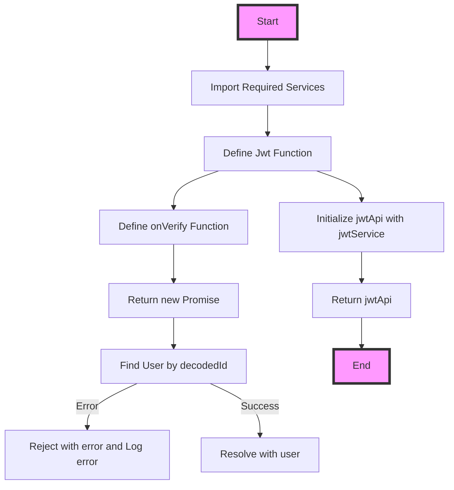

```mermaid
flowchart TD
    A[Start] --> B[Import Required Services]
    B --> C[Define Jwt Function]
    C --> D[Define onVerify Function]
    
    D --> D1[Return new Promise]
    D1 --> D2[Find User by decodedId]
    D2 -->|Error| D3[Reject with error and Log error]
    D2 -->|Success| D4[Resolve with user]

    C --> E[Initialize jwtApi with jwtService]
    E --> F[Return jwtApi]
    F --> G[End]

    style A fill:#f9f,stroke:#333,stroke-width:4px
    style G fill:#f9f,stroke:#333,stroke-width:4px
```