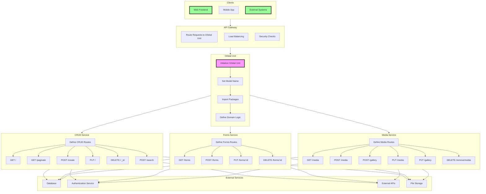

```mermaid
flowchart TB
    subgraph OrbitalUnit [Orbital Unit]
        direction TB
        A[Initialize Orbital Unit]
        B[Set Model Name]
        C[Import Packages]
        D[Define Domain Logic]
        
        A --> B
        B --> C
        C --> D
    end

    subgraph CRUDService [CRUD Service]
        direction TB
        E[Define CRUD Routes]
        E1[GET /]
        E2[GET /paginate]
        E3[POST /create]
        E4[PUT /]
        E5[DELETE /:_id]
        E6[POST /search]
        
        E --> E1
        E --> E2
        E --> E3
        E --> E4
        E --> E5
        E --> E6
    end

    subgraph FormsService [Forms Service]
        direction TB
        F[Define Forms Routes]
        F1[GET /forms]
        F2[POST /forms]
        F3[PUT /forms/:id]
        F4[DELETE /forms/:id]
        
        F --> F1
        F --> F2
        F --> F3
        F --> F4
    end

    subgraph MediaService [Media Service]
        direction TB
        G[Define Media Routes]
        G1[GET /media]
        G2[POST /media]
        G3[POST /gallery]
        G4[PUT /media]
        G5[PUT /gallery]
        G6[DELETE /remove/media]
        
        G --> G1
        G --> G2
        G --> G3
        G --> G4
        G --> G5
        G --> G6
    end

    subgraph ExternalServices [External Services]
        direction TB
        H[Database]
        I[Authentication Service]
        J[External APIs]
        K[File Storage]
    end

    subgraph APIGateway [API Gateway]
        direction TB
        L[Route Requests to Orbital Unit]
        M[Load Balancing]
        N[Security Checks]
    end

    subgraph Clients [Clients]
        direction TB
        O[Web Frontend]
        P[Mobile App]
        Q[External Systems]
    end

    OrbitalUnit --> CRUDService
    OrbitalUnit --> FormsService
    OrbitalUnit --> MediaService
    
    CRUDService --> H
    CRUDService --> I
    CRUDService --> J
    CRUDService --> K

    FormsService --> H
    FormsService --> I
    FormsService --> J
    FormsService --> K

    MediaService --> H
    MediaService --> I
    MediaService --> J
    MediaService --> K

    Clients --> APIGateway
    APIGateway --> OrbitalUnit

    style A fill:#f9f,stroke:#333,stroke-width:4px
    style O fill:#9f9,stroke:#333,stroke-width:4px
    style Q fill:#9f9,stroke:#333,stroke-width:4px
```