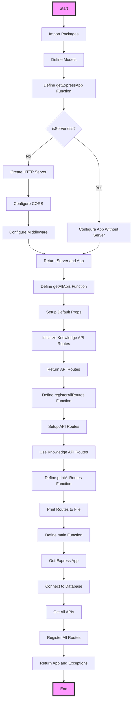

```mermaid
flowchart TD
    A[Start] --> B[Import Packages]
    B --> C[Define Models]
    C --> D[Define getExpressApp Function]
    D --> E{isServerless?}
    E -->|Yes| F[Configure App Without Server]
    E -->|No| G[Create HTTP Server]
    G --> H[Configure CORS]
    H --> I[Configure Middleware]
    I --> J[Return Server and App]
    F --> J
    
    J --> K[Define getAllApis Function]
    K --> L[Setup Default Props]
    L --> M[Initialize Knowledge API Routes]
    M --> N[Return API Routes]
    
    N --> O[Define registerAllRoutes Function]
    O --> P[Setup API Routes]
    P --> Q[Use Knowledge API Routes]
    
    Q --> R[Define printAllRoutes Function]
    R --> S[Print Routes to File]
    
    S --> T[Define main Function]
    T --> U[Get Express App]
    U --> V[Connect to Database]
    V --> W[Get All APIs]
    W --> X[Register All Routes]
    X --> Y[Return App and Exceptions]
    Y --> Z[End]

    style A fill:#f9f,stroke:#333,stroke-width:4px
    style Z fill:#f9f,stroke:#333,stroke-width:4px
```